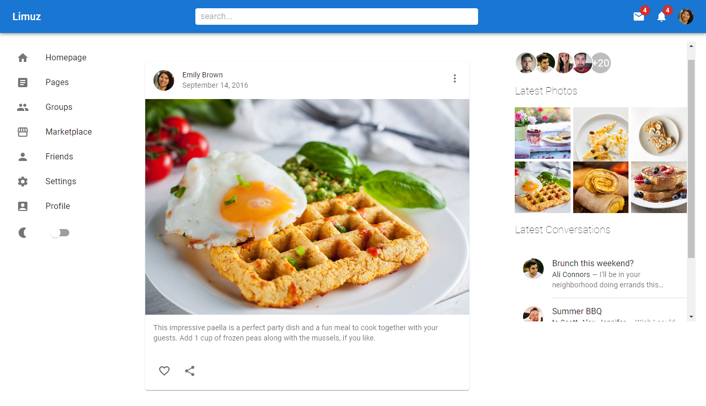

## MUI
Welcome to MUITest! This repository contains a project built with React and Material-UI, aimed at showcasing various components and features available in Material-UI.

visit: https://social-mediaapp07.web.app/

## Project Overview
MUI serves as a demonstration of how to implement Material-UI components and utilize its features within a React application. It includes examples of common UI elements, such as buttons, forms, navigation bars, and more, styled using Material-UI's design principles.

## Features
Material-UI Components: Explore a variety of Material-UI components and their usage patterns.
Responsive Design: The application is designed to be responsive, ensuring a consistent user experience across different devices and screen sizes.
Customization: Learn how to customize Material-UI components to fit your application's design requirements.
Getting Started
To run the application locally, follow these steps:

## Clone this repository to your local machine.
Navigate to the project directory in your terminal.
Install dependencies by running npm install.
Start the development server by running npm start.
Open your browser and navigate to http://localhost:3000 to view the application.
## Contributing
Contributions to this project are welcome! If you encounter any bugs, have suggestions for improvements, or would like to add new features, feel free to open an issue or submit a pull request.
